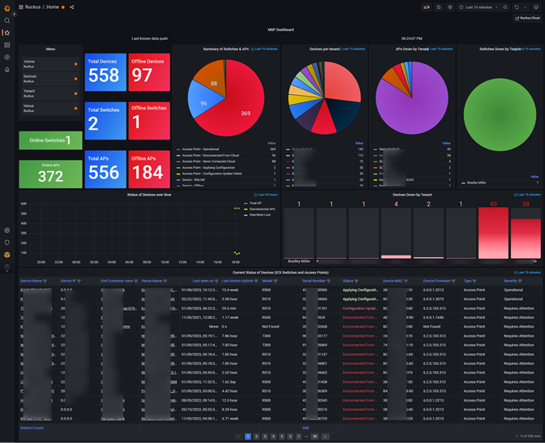
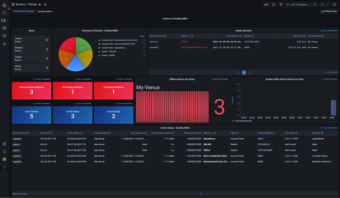
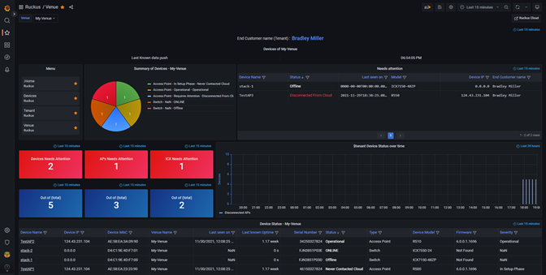
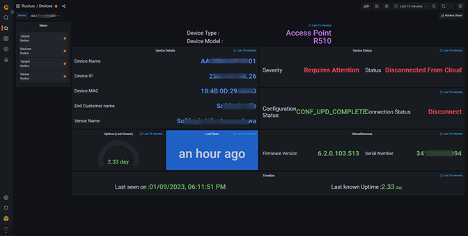

<a name="readme-top"></a>
<!--
*** Thanks for checking out the Ruckus MSP Cloud monitoring with Grafana. If you have a suggestion
*** that would make this better, please fork the repo and create a pull request
*** or simply open an issue with the tag "enhancement".
*** Don't forget to give the project a star!
*** Thanks again! Now go create something AMAZING! :D
-->


[![Contributors][contributors-shield]][contributors-url]
[![Forks][forks-shield]][forks-url]

[![Issues][issues-shield]][issues-url]
[![MIT License][license-shield]][license-url]
[![LinkedIn][linkedin-shield]][linkedin-url]


<!-- PROJECT LOGO -->
<br />
<div align="center">
  <a href="https://github.com/indhradhanush/rkscldmsp_grafana">
    
  </a>

  <h3 align="center">Ruckus MSP Cloud monitoring with Grafana</h3>

  <p align="center">
    This project is to pull data from Ruckus MSP Cloud API inventory and store in influxDB. Finally influxdb data is used as data source for Grafana. </BR> 
    <br />
    <a href="https://support.ruckuswireless.com/documents/4386"><strong>Explore the docs »</strong></a>
    <br />
    <br />
    <a href="#demo-pod">View Demo</a>
    ·
    <a href="https://github.com/indhradhanush/rkscldmsp_grafana/issues">Report Bug</a>
    ·
    <a href="https://github.com/indhradhanush/rkscldmsp_grafana/issues">Request Feature</a>
  </p>
</div>


<!-- TABLE OF CONTENTS -->
<details>
  <summary>Table of Contents</summary>
  <ol>
    <li>
      <a href="#about-the-project">About The Project</a>
      <ul>
        <li><a href="#demo-pod">Demo</a></li>
      </ul>
    </li>
    <li>
      <a href="#getting-started">Getting Started</a>
      <ul>
        <li><a href="#prerequisites">Prerequisites</a></li>
        <li><a href="#installation">Installation</a></li>
      </ul>
    </li>
    <li><a href="#usage">Usage</a></li>
    <li><a href="#roadmap">Roadmap</a></li>
    <li><a href="#contributing">Contributing</a></li>
    <li><a href="#license">License</a></li>
    <li><a href="#contact">Contact</a></li>
    <li><a href="#links">Links</a></li>
  </ol>
</details>


<!-- ABOUT THE PROJECT -->
## About The Project

[![Product Name Screen Shot][product-screenshot]](https://ruckus.cloud)

Ruckus MSP Cloud is a platform for managed service providers to manage and monitor their customers' Ruckus networks. It provides tools for remote network performance monitoring, account and billing management, and reporting.

Grafana is an open-source platform for data visualization and monitoring. It allows you to create, explore, and share dashboards and supports multiple backends for storing time series data. It is commonly used for DevOps, IoT, and real-time analytics.

 Grafana helps solving the MSP related problem where an MSP admin can do the following.</BR>
    1.	Single Dashboard to view all device status irrespective of tenant. </BR>
    2.	View limited monitoring information quickly about a tenant without must go to MSP inventory page.</BR>
    3.	Kiosk requirement – MSP admins often require Kiosk screen to show in a centralized NOC display, which allows quick glance of status of devices. Change settings token_rotation_interval_minutes and login_maximum_inactive_lifetime_days in Grafana.ini
    Grafana, an open-source tool is implemented as a separate system in a Linux machine. This is only a visualization tool, so it would need a time series database (TSDB) to visualize. In this guide dog we will use Influxdb as the TSDB.
To get the data from Ruckus MSP Cloud to Influxdb, Python program will be used. Python will retrieve data using Ruckus MSP API and moderate it before inserting into Influxdb.

<p align="right">(<a href="#readme-top">back to top</a>)</p>

### Demo pod

Screenshots of the successful installation of Grafana, Python and Influx will result the following:

<a href="https://grafana.com/grafana/dashboards/17847">
    
</a>

* <a href="https://grafana.com/grafana/dashboards/17847">RUCKUS MSP Cloud Dashboard - Home : https://grafana.com/grafana/dashboards/17847</a>

<a href="https://grafana.com/grafana/dashboards/17852">
    
</a>

* <a href="https://grafana.com/grafana/dashboards/17852">RUCKUS MSP Cloud Dashboard - Tenant : https://grafana.com/grafana/dashboards/17852</a>

<a href="https://grafana.com/grafana/dashboards/17853">
    
</a>

* <a href="https://grafana.com/grafana/dashboards/17853">RUCKUS MSP Cloud Dashboard - Venue : https://grafana.com/grafana/dashboards/17853</a>

<a href="https://grafana.com/grafana/dashboards/17854">
    
</a>

* <a href="https://grafana.com/grafana/dashboards/17854">RUCKUS MSP Cloud Dashboard - Devices : https://grafana.com/grafana/dashboards/17854</a>


<p align="right">(<a href="#readme-top">back to top</a>)</p>


<!-- GETTING STARTED -->
## Getting Started

To get started one has to have an Linux server (Recommended) or Windows machine that runs python. The following pre-requisites has to be met 
Installation of Grafana, Python are not covered in here.
https://onlyoneaman.medium.com/how-to-install-tig-stack-telegraf-influx-and-grafana-on-ubuntu-405755901ac2
https://www.digitalocean.com/community/tutorials/how-to-install-python-3-and-set-up-a-programming-environment-on-ubuntu-22-04 

### Prerequisites

This is an example of how to list things you need to use the software and how to install them.
* python3
  ```sh
  pip install -r requirements.txt
  ```

### Installation

At the location of choice of MSP admin, unzip the rkscldmsp_grafana.zip. It should provide the following directory structure.

1. Get a readonly admin account from RUCKUS MSP account [https://ruckus.cloud](https://ruckus.cloud)
2. Clone the repo
   ```sh
   git clone https://github.com/indhradhanush/rkscldmsp_grafana.git
   ```
3. Install to populate the credentials
   ```sh
   python3 install.py
   ```
4. Enter RUCKUS MSP Cloud and Influx details in `configure.py`
   ```js
   # Ruckus Cloud MSP - Python program to extract from API and update influx database.
   # configure.py - edit this script to store variables. 
   # - Store variables to use in program.
   rks_domain = "ruckus.cloud"
   rks_username = "karthik@countrymsp.com"
   influx_host = '192.168.116.128'
   influx_port = 8086
   influx_database = "ruckus"
   influx_username = 'ruckus_karthik'
   pageSize = 1000
   #EOL
   ```

<p align="right">(<a href="#readme-top">back to top</a>)</p>


<!-- USAGE EXAMPLES -->
## Usage

* [Installation Guide](https://support.ruckuswireless.com/documents/4386)

To run this python project, run the app.py which is the main file of this project. Before running this make sure all the pre-requisites are met. Python script outputs the data while inserting into InfluxDB. This info are for troubleshooting purposes. 
```py
python3 src/app.py
```

Install and run Grafana Dashboards. Dashboards ID are 17847, 17852, 17853, and 17854 from https://grafana.com/grafana/dashboards/

<p align="right">(<a href="#readme-top">back to top</a>)</p>


<!-- ROADMAP -->
## Roadmap

- [x] Add README

See the [open issues](https://github.com/indhradhanush/rkscldmsp_grafana/issues) for a full list of proposed features (and known issues).

<p align="right">(<a href="#readme-top">back to top</a>)</p>


<!-- CONTRIBUTING -->
## Contributing

Contributions are what make the open source community such an amazing place to learn, inspire, and create. Any contributions you make are **greatly appreciated**.

If you have a suggestion that would make this better, please fork the repo and create a pull request. You can also simply open an issue with the tag "enhancement".
Don't forget to give the project a star! Thanks again!

1. Fork the Project
2. Create your Feature Branch (`git checkout -b feature/AmazingFeature`)
3. Commit your Changes (`git commit -m 'Add some AmazingFeature'`)
4. Push to the Branch (`git push origin feature/AmazingFeature`)
5. Open a Pull Request

<p align="right">(<a href="#readme-top">back to top</a>)</p>


<!-- LICENSE -->
## License

Distributed under the Apache License. See `LICENSE.txt` for more information.

<p align="right">(<a href="#readme-top">back to top</a>)</p>


<!-- CONTACT -->
## Contact

Karthikeyan Krish - [@iamkarthikkrish](https://twitter.com/iamkarthikkrish)

Project Link: [https://github.com/indhradhanush/rkscldmsp_grafana](https://github.com/indhradhanush/rkscldmsp_grafana)

<p align="right">(<a href="#readme-top">back to top</a>)</p>


<!-- LINKS -->
## LINKS
* [Installation Guide](https://support.ruckuswireless.com/documents/4386)

Dashboards from Grafana marketplace: 
* [Home - https://grafana.com/grafana/dashboards/17847](https://grafana.com/grafana/dashboards/17847)
* [Tenants - https://grafana.com/grafana/dashboards/17852](https://grafana.com/grafana/dashboards/17852)
* [Venues - https://grafana.com/grafana/dashboards/17853](https://grafana.com/grafana/dashboards/17853)
* [Devices - https://grafana.com/grafana/dashboards/17854](https://grafana.com/grafana/dashboards/17854) 


* [RUCKUS Cloud](https://ruckus.cloud)
* [About RUCKUS Cloud](https://www.commscope.com/ruckuscloud)
* Forked by : https://github.com/mmMOLINARI/RUCKUS-Cloud-MSP-Grafana and https://github.com/commscope-ruckus/RUCKUS-Cloud-MSP-Grafana


<p align="right">(<a href="#readme-top">back to top</a>)</p>


<!-- MARKDOWN LINKS & IMAGES -->
<!-- https://www.markdownguide.org/basic-syntax/#reference-style-links --> 
[contributors-shield]: https://img.shields.io/badge/CONTRIBUTORS-1-<COLOR>.svg
[contributors-url]: https://github.com/indhradhanush/rkscldmsp_grafana/graphs/contributors
[forks-shield]: https://img.shields.io/badge/FORKS-2-<COLOR>.svg
[forks-url]: https://github.com/indhradhanush/rkscldmsp_grafana/network/members
[stars-shield]: https://img.shields.io/badge/STARS-2-<COLOR>.svg
[stars-url]: https://github.com/indhradhanush/rkscldmsp_grafana/stargazers
[issues-shield]: https://img.shields.io/badge/ISSUES-0-<COLOR>.svg
[issues-url]: https://github.com/indhradhanush/rkscldmsp_grafana/issues
[license-shield]: https://img.shields.io/badge/LICENSE-Apache-<COLOR>.svg
[license-url]: https://github.com/indhradhanush/rkscldmsp_grafana/master/LICENSE.txt
[linkedin-shield]: https://img.shields.io/badge/LinkedIn-0077B5?style=for-the-badge&logo=linkedin&logoColor=white
[linkedin-url]: https://linkedin.com/in/mkarthikeyan
[product-screenshot]: docs/sysdes.PNG
[Python.js]: https://img.shields.io/badge/Python-3776AB?style=for-the-badge&logo=python&logoColor=white
[Python-url]: https://www.python.org/
